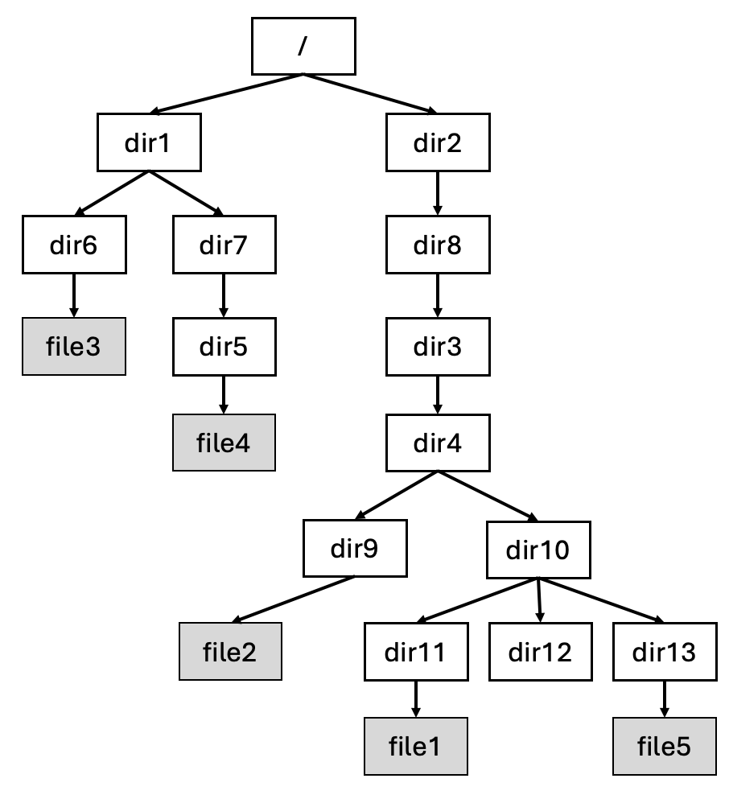

# CSCI 3150 Introduction to Operating Systems

# Assignment Four

## 1. Basic Information

- **Topics: File System**

- **Total Marks: 100**

- **Deadline: 18:00:00 p.m., Mon, Dec. 9th**

- **Submission: Github classroom**

## 2. **Mandatory Part (100 marks, 2 problems)**

1. Question One (50 marks)
   
   In SFS, there exist the files with the hierarchy shown in the figure below.
   
   
   
   Here, “/” is the root directory; “dir1”, “dir2”, “dir3”, “dir4”, “dir5”, “dir6”, “dir7”, “dir8”,
   “dir9”, “dir10”, “dir11”, “dir12” and “dir13” are directory file; “file1”, “file2”, “file3”,
   “file4”, “file5” are regular file.  
   
   
   Suppose we have known that the inode numbers of “/”, “dir1”, “dir2”, “dir3”, “dir4”, “dir5”, “dir6”, “dir7”, “dir8”, “dir9”, “dir10”, “dir11”, “dir12”, “dir13”, “file1”, “file2”, “file3”, “file4” and “file5” are 0, 1, 2, 3, 4, 5, 6, 7, 8, 9, 10, 11, 12, 13, 14, 15, 16, 17 and 18, respectively.
   
   
   
   Moreover, each directory file only occupies one data block (4 KB for one data block), and the data block numbers allocated to “/”, “dir1”, “dir2”, “dir3”, “dir4”, “dir5”, “dir6”, “dir7”, “dir8”, “dir9”, “dir10”, “dir11”, “dir12” and “dir13” are 0, 1, 2, 3, 4, 5, 6, 7, 8, 9, 10, 11, 12, 13 respectively.
   
   
   
   **Answer the following questions:**
   
   (a). Suppose that each directory entry in a directory file is defined by the following structure:
   
   ```c
   typedef struct directory_mapping {
         char file_name[20]; /* The file name of the file */
         int inode_number; /* The inode number of the file*/ 
   }DIR_NODE;
   ```
   
   Each directory file should at least contain two mapping items, “.” and “..”, for itself and its parent directory, respectively (the parent of the root directory is itself). **Give the contents of data blocks 0, 1, 5, 8 and 10, respectively**. (30 marks)
   
   
   
   ( *For each data block, use the following format to list one map*:
   
   **`file_name inode_number `** 
   
   *For example, if “dir12” and “12” are stored in a data block (as the file name and
   inode correspondingly), then show them as follows:*
   
   **`dir12 12  `**
   
   *Note that the mappings for “.” and “..” needs to be displayed as well in a data block.*)
   
   
   
   (b) Suppose a user provides the following absolute path:
   
   **`/dir1/dir7/dir5/file4`**
   
       Show the sequence of the inode numbers and data block numbers we need to pass in order to **obtain the inode number of file4** (starting from the root directory). (20 marks)


2. Question Two (50 marks)

   Suppose that there is a file with SFS and we have read the contents of its inode and related data blocks into the memory as shown in the following figure.

   

   - Here, each cell represents a 4-byte memory space and the decimal number inside is the unsigned integer stored correspondingly. **All data blocks in this file system have the same size**.
   - Direct pointers directly link to data blocks. Each direct pointer accesses a specific data block, allowing direct retrieval of file content.In the given inode example, the 1st direct pointer and 2nd direct pointer point to data blocks 5 and 19, respectively, meaning the initial parts of the file are stored in these blocks.
   - An indirect pointer points to a block that contains additional pointers, each of which links to another data block. This allows the file system to access a larger number of data blocks and therefore supports larger files. In the example, the indirect pointer points to data block 25. Block 25 doesn’t hold file content but instead stores a list of pointers (e.g., to blocks 45, 51, 71, etc.), enabling indirect access to more data blocks as needed for large files.


   **Answer the following questions:**

   (a) [10 Marks]: 

    - (i) Assume that the size of one data block is **8 KB**. How many cells are there in data block 25?

    - (ii) Given that the maximum size of the single file in SFS is **4104 KB**, calculate the size of one data block in the system. Please express your answer in **KB**.


   (b) [40 Marks]: 
    - Assume that the size of one data block is **4 KB**. You are required to determine the sequence of data blocks that will be read from the disk (only include blocks containing file data) when calling the functions `read_t()` and `read_continue_t()` in a user program.

      #### **Function Definitions**
    
        **`read_t (inum, offset, buff, count)`**:
        - inum represents the inode number corresponding to the file, and buff is a pointer to a user-defined buffer where the data will be stored.
        - This function reads data starting from the specified **offset** within the file.
        - The read operation retrieves **count** bytes of data into the buffer buff.
        - Each call to `read_t()` starts from the file’s beginning and reads from the given `offset` anew. It does **not** depend on any prior read operations.
    
        **`read_continue_t (inum, offset, buff, count)`**:
        - This function reads data **continuing from the end position reached by the previous `read_t()` or `read_continue_t()` call**.
        - This function reads data starting from the specified offset, which is relative to the ending position of the last operation.
        - If `read_continue_t()` is called for the first time, it behaves the same way as `read_t()`.
    
        ---
    
      ### **Example**
    
        | **Operation Order** | **Function Call**                     | **Data Blocks Accessed (only include those containing file data)** |
        |---------------------|---------------------------------------|-------------------------------------------------------------------|
        | 1st Operation       | `read_t (inum, 133, buff, 40);`      | 5                                                                 |
        | 2nd Operation       | `read_continue_t (inum, 133, buff, 6000);` | 5, 19                                                            |
    
        - **Explanation**:
        - The first operation, `read_t (inum, 133, buff, 40)`, reads **40 bytes** starting at an offset of **133 bytes**. This falls within data block **5**.
        - For the second operation, `read_continue_t (inum, 133, buff, 6000)`, since it is a `read_continue_t()` call, it continues from where the first read ended:
            - The first read ends at byte `133 + 40 = 173`.
            - Thus, the second read begins at byte **173+133** and reads the next **6000 bytes**, covering blocks **5** and **19**.
    
        ---
    
      ### **Tasks**
    
        Based on the inode and data block information provided earlier, determine which data blocks will be accessed for the following function calls:
    
        | **Operation Order** | **Function Call**                             | **Data Blocks Accessed (only include those containing file data)** |
        |---------------------|----------------------------------------------|-------------------------------------------------------------------|
        | 1st Operation       | `read_t (inum, 200, buff, 1000);`          |                                                                   |
        | 2nd Operation       | `read_t (inum, 5000, buff, 5000);`         |                                                                   |
        | 3rd Operation       | `read_continue_t (inum, 5000, buff, 3000);`|                                                                   |
        | 4th Operation       | `read_continue_t (inum, 1000, buff, 20480);` |                                                                   |
    
        ---


## 3. Submissions

- **For Question 2, you may provide direct answers without showing your process. However, if an answer is incorrect, partial credit cannot be awarded. Therefore, we recommend including calculation steps for any parts you’re uncertain about.**
- **Plagiarism, incorrect file name, and lack of comments** **will result in various degrees of deductions in points.**
- The use of any AI tools is strictly prohibited for this assignment. Violations will result in a score of zero.
- In problem1, you need to submit a pdf file named "question1.pdf".
- In problem2, you need to submit a pdf file named "question2.pdf".
- **Assignment directory structure for submission**
  
  - assignment-four-student (repo root directory)
    - mandatory
      - question1.pdf
      - question2.pdf
- YANG,Yitao and FENG,Yicheng are responsible for this assignment. Questions about the assignment via Piazza are welcomed. Due to massive class size, no individual email will be replied. Requests including but not limited to asking TA to set up environment, write code and debug for you will be rejected according to regulations.
